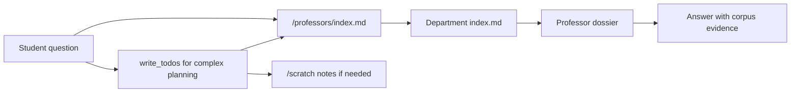

# DeepAgents Corpus Filesystem Tutorial

This note explains how DeepAgents file access should work in this app now that the professor corpus is grouped by department.

Useful references:

- DeepAgents overview: https://docs.langchain.com/oss/python/deepagents/overview
- DeepAgents backends: https://docs.langchain.com/oss/python/deepagents/backends
- DeepAgents permissions: https://docs.langchain.com/oss/python/deepagents/permissions

The core rule is simple:

- `/professors` is read-only source evidence.
- `/scratch` is the only writable agent workspace.
- `write_todos` is planning state, not a Markdown file write.
- `execute` stays unavailable.

## What `write_todos` Really Does

`write_todos` does not create, edit, or delete Markdown files. In the installed stack used by this app, DeepAgents exposes todo management through LangChain's todo middleware. Calling `write_todos` updates the LangGraph `todos` state channel and returns a tool message about the todo list.

Local verification point:

```text
backend/.venv/lib/python3.12/site-packages/langchain/agents/middleware/todo.py
```

That means:

- It is safe to expose `write_todos` for multi-step reasoning.
- It does not write into `backend/app/corpus/professors`.
- It should be described to the model as an internal planning tool.
- It should not be treated as a filesystem mutation in tests.

Use it when the user asks a broad or complicated question, for example:

```text
Find possible advisors across AI, education, and robotics, then compare the strongest candidates.
```

The agent can create todo items like "read corpus root index", "inspect education index", "inspect computer science index", and "compare candidate dossiers" without creating any corpus files.

## What Filesystem Tools Can Do

DeepAgents filesystem tools are separate from `write_todos`.

The safe filesystem tools exposed in this app are:

- `ls`
- `read_file`
- `glob`
- `grep`
- `write_file`
- `edit_file`

Their behavior depends on the configured backend. In this app they must go through a `CompositeBackend`, so paths are virtual app paths, not arbitrary host machine paths.

The unsafe tools for this stage are not exposed:

- `execute`
- `task`

`execute` is the main deletion and exfiltration risk because shell commands can run things like `rm`, `cat .env`, or network commands when a shell-capable backend is enabled. This app should not use a sandbox or local-shell backend, and the allowlist should keep `execute` hidden from the model.

## Where Corpus Reads Happen

The professor source files live in the repository under:

```text
backend/app/corpus/professors
```

The agent sees that folder as:

```text
/professors
```

The important files are:

```text
/professors/index.md
/professors/<department-slug>/index.md
/professors/<department-slug>/publications-index.md
/professors/<department-slug>/<professor-slug>.md
```

Recommended routing:

1. Broad query: read `/professors/index.md`.
2. Department-specific query: read `/professors/<department-slug>/index.md`.
3. Publication-related query: read `/professors/<department-slug>/publications-index.md`, then verify candidates in the individual professor dossiers.
4. Candidate evidence: read individual professor dossiers.
5. Ambiguous name or repeated slug: use department-qualified profile IDs such as `computer-science-and-technology/li-xin`.

The custom professor tools follow the same contract:

- `list_departments`
- `read_department_index`
- `list_professors`
- `search_professors`
- `read_professor_profile`
- `compare_professors`

## Where Persistent Scratch Files Live

Scratch files should live outside the professor corpus.

The backend setting is:

```text
LAB4_AGENT_SCRATCH_DIR
```

If it is not set, the default is:

```text
backend/scratch
```

In Docker, the default path becomes:

```text
/app/scratch
```

The agent sees scratch as:

```text
/scratch
```

This is where the model may create working notes:

```text
/scratch/search-notes.md
/scratch/candidate-comparison.md
/scratch/topic-routing.md
```

Scratch is persistent by design, but it is not source-of-truth data. It can help the agent continue or inspect its own working notes, but final answers should still be grounded in `/professors` evidence.

## Why Professor Markdown Is Protected

The professor Markdown files are the corpus source of truth. They should not change during user conversations, even if the user asks the agent to:

- fix a typo in a professor dossier
- add a new professor
- delete a profile
- rewrite a department index
- store notes next to a professor file

Those requests must be refused or redirected. The app can explain that the corpus is read-only and that working notes can only be placed under `/scratch`.

Protection happens in three layers:

1. The app prompt tells the model that `/professors` is read-only.
2. DeepAgents permissions deny writes to `/professors/**`.
3. Docker marks the packaged corpus read-only and keeps writable scratch separate.

## Recommended Backend And Permission Configuration

Recommended backend shape:

```python
from deepagents.backends import CompositeBackend, FilesystemBackend, StateBackend

backend = CompositeBackend(
    default=StateBackend(),
    routes={
        "/professors/": FilesystemBackend(
            root_dir=professors_dir,
            virtual_mode=True,
        ),
        "/scratch/": FilesystemBackend(
            root_dir=scratch_dir,
            virtual_mode=True,
        ),
    },
)
```

Recommended permissions:

```python
from deepagents import FilesystemPermission

permissions = [
    FilesystemPermission(
        operations=["read"],
        paths=["/", "/professors", "/professors/**", "/scratch", "/scratch/**"],
        mode="allow",
    ),
    FilesystemPermission(
        operations=["write"],
        paths=["/scratch", "/scratch/**"],
        mode="allow",
    ),
    FilesystemPermission(
        operations=["write"],
        paths=["/professors", "/professors/**"],
        mode="deny",
    ),
    FilesystemPermission(
        operations=["read", "write"],
        paths=["/**", "/**/.*"],
        mode="deny",
    ),
]
```

Ordering matters. DeepAgents permissions are first-match-wins, and if nothing matches the default is allow. That is why the final deny-all rule is required. The extra `/**/.*` pattern is intentional so hidden files such as `.env` do not slip through the permissive default.

Permissions apply to built-in filesystem tools. They do not automatically secure custom tools, so custom professor tools must continue validating department slugs and profile IDs themselves.

## Examples Of Safe And Unsafe Tool Calls

Safe reads:

```text
ls(path="/")
read_file(file_path="/professors/index.md")
read_file(file_path="/professors/computer-science-and-technology/index.md")
read_file(file_path="/professors/computer-science-and-technology/li-xin.md")
grep(pattern="Machine Learning", path="/professors/computer-science-and-technology")
```

Safe scratch writes:

```text
write_file(file_path="/scratch/search-notes.md", content="Candidate notes...")
edit_file(file_path="/scratch/search-notes.md", old_string="Candidate", new_string="Shortlisted candidate")
```

Safe planning:

```text
write_todos(todos=[...])
```

Unsafe corpus writes:

```text
write_file(file_path="/professors/computer-science-and-technology/li-xin.md", content="...")
edit_file(file_path="/professors/index.md", old_string="753", new_string="754")
write_file(file_path="/professors/new-department/new-professor.md", content="...")
```

Unsafe hidden tools:

```text
execute(command="rm -rf /professors")
execute(command="cat /app/.env")
task(description="Use a subagent to inspect files")
```

These should not appear as model-visible tools in this app.

## How This Fits The App

The backend loads professor dossiers recursively from:

```text
backend/app/corpus/professors/<department>/<professor>.md
```

It exposes canonical profile IDs:

```text
<department-slug>/<professor-slug>
```

The DeepAgent should route through indexes before dossiers:



If the model needs notes, they belong in `/scratch`. If it needs evidence, it must read `/professors`. Those two paths should never be confused.
