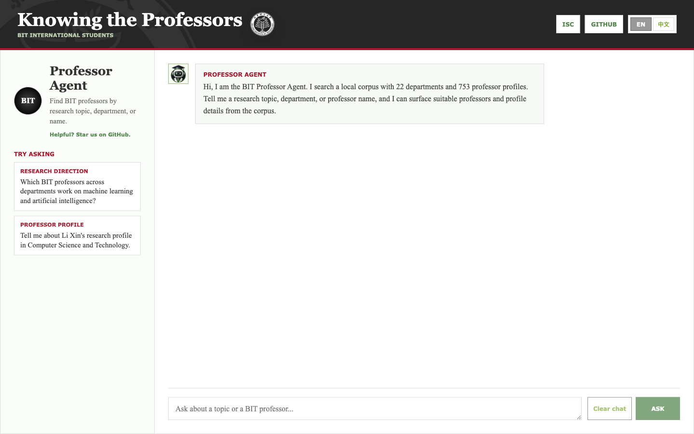

# BIT International Students

Open-source tools for helping international students explore Beijing Institute of Technology resources.

Try the deployed Professor Agent: [bitagent.labtutor.app](https://bitagent.labtutor.app)

The repository is open for pull requests. If the project helps you, please star it on GitHub and consider contributing.



## Professor Agent

Professor Agent is a web chat app for exploring BIT professors by research topic, department, name, and publication evidence. It searches a local corpus with 22 departments and 753 professor dossiers, then streams a Markdown answer back to the student.

Students can ask questions such as:

- Which BIT professors work on machine learning and artificial intelligence?
- Tell me about Li Xin's research profile in Computer Science and Technology.
- Which professors have publications related to process mining?
- Compare possible professors for robotics, medical imaging, or cybersecurity.

The public app is read-focused. It does not expose crawler workflows, uploads, professor editing, shell execution, or add-professor routes.

## How It Works


The app follows a short request path:

```text
Student question
  -> React chat UI
  -> FastAPI streaming endpoint
  -> DeepAgents graph
  -> corpus and index tools
  -> professor dossier evidence
  -> streamed Markdown answer
```

The DeepAgents setup lives in `backend/app/agent.py`. `ProfessorAgentService` builds one agent with the system prompt from `backend/app/prompts.py`, read-only professor-corpus tools from `backend/app/tools.py`, a virtual filesystem, and an in-memory LangGraph checkpointer.

The model can inspect the corpus, search indexes, compare profiles, and write temporary notes in `/scratch`. It cannot use shell execution, subagents, delete tools, crawler routes, upload routes, or professor-editing routes.

## Corpus Files

The professor corpus is under `backend/app/corpus/professors/`.

- `professors/index.md` routes broad questions to likely departments.
- `professors/<department>/index.md` gives a department roster and topic guide.
- `professors/<department>/publications-index.md` routes paper and publication questions.
- `professors/<department>/<professor>.md` is the final evidence layer for summaries, comparisons, and publication claims.

Indexes help the agent search quickly, but individual professor dossiers are the source of truth for final answers.

## Contributing

Pull requests are welcome. Useful contributions include:

- improving professor dossier quality
- fixing metadata, department labels, official URLs, or OCR artifacts
- improving root, department, and publication indexes
- adding tests for corpus behavior, DeepAgents safety, streaming, or frontend UI
- improving bilingual text and documentation
- proposing future tools for international students beyond professor exploration

Please keep secrets out of the repository, keep changes focused, explain the student-facing impact, and run the checks that match your change.

## Run Locally

Copy the example environment file and add model credentials:

```bash
cp .env.example .env
```

Required model settings:

```env
BIT_PROF_LLM_API_KEY=your-llm-api-key
BIT_PROF_LLM_BASE_URL=https://api.silra.cn/v1/
BIT_PROF_LLM_MODEL=deepseek-v4-flash
```

Run with Docker Compose:

```bash
docker compose build
docker compose up -d
```

Open `http://127.0.0.1:8081`.

Development checks:

```bash
cd backend
uv run python -m pytest -v

cd ../frontend
npm test -- --run
npm run build
```

## License

This project is licensed under the MIT License. See [LICENSE](LICENSE).
