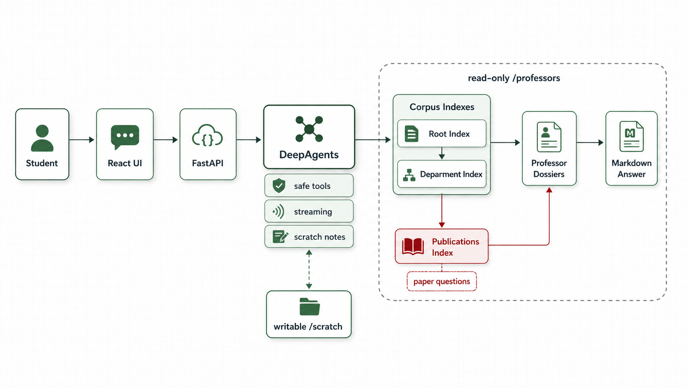

# BIT International Students

Open-source tools for helping international students explore Beijing Institute of Technology resources.

The first tool in this repository is **Professor Agent**: a web chat app that helps students explore BIT professors by research topic, department, name, and publication evidence. The repository is open for pull requests. If the project helps you, please star it on GitHub and consider contributing.



## Professor Agent

Professor Agent searches a local BIT professor corpus containing:

- 22 departments
- 753 professor dossiers
- 1,485 source pages represented in the corpus metadata
- Department routing indexes, department rosters, publication indexes, and individual professor Markdown dossiers

Students can ask questions such as:

- Which BIT professors work on machine learning and artificial intelligence?
- Tell me about Li Xin's research profile in Computer Science and Technology.
- Which professors have publications related to process mining?
- Compare possible professors for robotics, medical imaging, or cybersecurity.

The public student app is read-focused. It does not expose crawler workflows, uploads, professor Markdown editing, shell execution, or add-professor routes.

## How The Agent Works

The app follows this request path:

```text
Student question
  -> React chat UI
  -> FastAPI streaming endpoint
  -> DeepAgents graph
  -> corpus/index tools
  -> professor dossier evidence
  -> streamed Markdown answer
```

The frontend sends a student question to:

```text
POST /api/sessions/{thread_id}/runs/stream
```

FastAPI returns newline-delimited stream events:

- `run_started`
- `activity`
- `message_delta`
- `run_finished`
- `error`

The UI renders safe high-level activity labels, such as "Reading a department index" or "Searching professor profiles", while the final answer streams as Markdown.

## DeepAgents Design

The DeepAgents setup lives in `backend/app/agent.py`.

At runtime, `ProfessorAgentService` builds one DeepAgent with:

- a configured chat model
- the system prompt from `backend/app/prompts.py`
- professor-corpus tools from `backend/app/tools.py`
- a `CompositeBackend`
- explicit filesystem permissions
- an in-memory LangGraph checkpointer
- middleware that filters the tool list before the model sees it

DeepAgents normally includes a broad default tool suite. This app narrows it deliberately. The model can use:

- `write_todos`
- `ls`
- `read_file`
- `glob`
- `grep`
- `write_file`
- `edit_file`
- `list_departments`
- `read_department_index`
- `list_professors`
- `search_professors`
- `read_professor_profile`
- `compare_professors`

The app does not expose shell `execute`, subagent `task`, delete tools, upload routes, crawler routes, or professor-editing routes.

## Filesystem Model

The DeepAgent sees two important virtual paths:

```text
/professors  read-only evidence corpus
/scratch     writable working notes
```

`/professors` is routed to the local professor corpus with a filesystem backend in virtual mode. `/scratch` is routed to a separate scratch workspace. Permission rules allow corpus reads and scratch writes, then deny writes to `/professors` and deny access outside the approved virtual paths.

This lets the agent inspect source evidence and maintain temporary notes without mutating the corpus or reading server secrets.

## Corpus And Index Files

The professor corpus is under:

```text
backend/app/corpus/professors/
```

The agent is prompted to use the corpus in layers:

1. **Root index**
   `professors/index.md`

   This is the routing map. It lists departments, professor counts, department slugs, and "good for" topic hints. Broad or cross-department questions start here.

2. **Department index**
   `professors/<department>/index.md`

   This is a department-level roster and topic guide. It helps the agent find likely professor candidates before opening full dossiers.

3. **Publications index**
   `professors/<department>/publications-index.md`

   This is used for paper, venue, publication, and representative-work questions. It routes the agent toward professors whose dossiers mention relevant publications.

4. **Professor dossier**
   `professors/<department>/<professor>.md`

   This is the final evidence layer. Candidate-level recommendations should be grounded here, especially when the answer compares fit, summarizes a professor, or cites publication evidence.

The important design choice is that indexes route the search, but individual professor dossiers prove the answer.

## Publication Questions

Publication questions get a stricter workflow:

1. Identify likely departments through the root and department indexes.
2. Read the department `publications-index.md`.
3. Use that file as a routing aid, not as the final source of truth.
4. Open each relevant professor dossier.
5. Verify the dossier's `## Publications` section before making claims.

The publication indexes are copied from professor dossier publication sections and may contain OCR-derived representative publications. They are useful for search, but they are not guaranteed to be complete publication histories.

## Prompt Policy

The system prompt asks the agent to:

- stay inside BIT professor exploration
- use department-qualified profile IDs because names can repeat
- include official profile URLs when available
- say when evidence is thin, missing, or uncertain
- be warm, respectful, and non-judgmental
- frame candidates as good possible fits, not rankings of who is "best"
- encourage students to verify fit through official profile URLs, publications, and department contact

## Contributing

Pull requests are welcome.

Good contributions include:

- improving professor dossier quality
- fixing metadata, names, department labels, official URLs, or OCR artifacts
- improving root, department, or publication indexes
- adding tests for corpus behavior, DeepAgents safety, streaming, or frontend UI
- improving bilingual text
- making the README clearer for students and contributors
- proposing future tools for international students, such as campus FAQ, scholarship information, course guidance, or department exploration

Before opening a PR:

1. Keep secrets out of the repository.
2. Keep changes focused.
3. Explain the student-facing impact.
4. Preserve the read-only public Professor Agent model.
5. Run the checks that match your change.

## Run Locally

Copy the example environment file and add model credentials:

```bash
cp .env.example .env
```

Required model settings:

```env
BIT_PROF_LLM_API_KEY=your-llm-api-key
BIT_PROF_LLM_BASE_URL=https://api.silra.cn/v1/
BIT_PROF_LLM_MODEL=deepseek-v4-flash
```

Run with Docker Compose:

```bash
docker compose build
docker compose up -d
```

Open:

```text
http://127.0.0.1:8081
```

Health checks:

```bash
curl http://127.0.0.1:8081/healthz
curl http://127.0.0.1:8081/readyz
```

## Development Checks

Backend:

```bash
cd backend
uv run python -m pytest -v
```

Frontend:

```bash
cd frontend
npm test -- --run
npm run build
```

## Optional Admin Log

The backend can store raw student questions and final agent answers in SQLite for basic usage review. Writes happen asynchronously after a run finishes, so log I/O does not block the student response.

Configure:

```env
LAB4_ADMIN_USERNAME=admin
LAB4_ADMIN_PASSWORD=replace-with-a-strong-password
LAB4_QA_LOG_DB_PATH=/app/analytics/question_answer_log.sqlite3
```

Read recent rows:

```bash
curl -u "$LAB4_ADMIN_USERNAME:$LAB4_ADMIN_PASSWORD" \
  "http://127.0.0.1:8081/api/admin/question-answer-log?limit=50"
```

## Optional Tunnel Deployment

If you want to expose a Docker deployment through Cloudflare Tunnel, set:

```env
CLOUDFLARE_TUNNEL_TOKEN=your-token
```

Then run:

```bash
docker compose -f docker-compose.yml -f docker-compose.tunnel.yml up -d --build
```

## License

This project is licensed under the MIT License. See [LICENSE](LICENSE).
